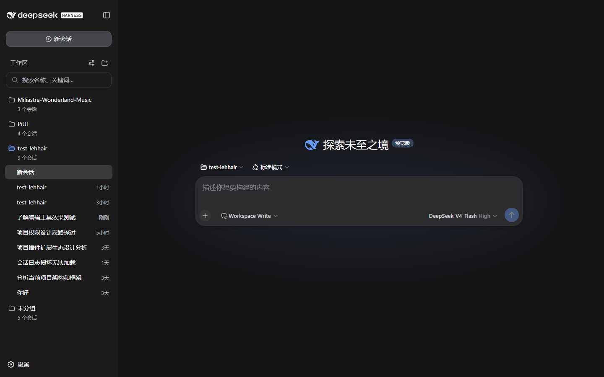
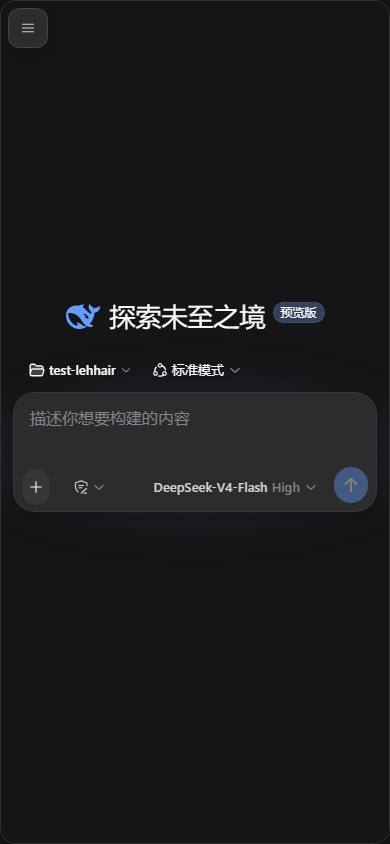
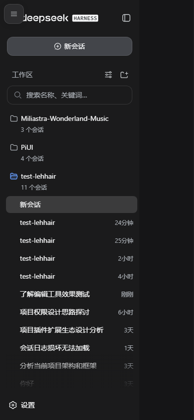

# dsh-mobile

DSH WebUI 移动端适配插件（**PiUI 翻页器模式**）：信息流**原样保留**，整页左右翻页打开侧边栏——窄屏下框架本身就是横向 scroll-snap 翻页器（侧边栏 | 聊天），聊天页全宽且渲染零改动。纯客户端适配，零核心改动——官方 rc.2 发行版直接可用，不依赖任何扩展点 patch。

## 功能

- **左右翻页（PiUI mobile-chat-pager）**：≤768px 时三栏框架重排为两页全宽横向 snap 容器——侧边栏页与聊天页各占整屏；**手指向右拖打开侧边栏、向左拖返回聊天**（跨过中点自动吸附到整页，滑不到位也会回弹/修正，永不卡在半页），或点左上角 ☰ 程序化翻页（带滑入动画）
- **PiUI 3D 翻页**：滚动时聊天卡片带 `rotateY/scale` 微效果（控制器按 scrollLeft 驱动 CSS 变量），`prefers-reduced-motion` 时关闭
- **信息流原样**：聊天列就是原生渲染，一行未改，只是被放进翻页容器
- **聊天卡片（PiUI 风）**：聊天页是贴边圆角卡片（16px 圆角 + 柔和阴影 + 细边框），浮在翻页器上；侧边栏页与信息流**同色**（平页，无浮层感）
- **状态驱动 + 吸附修正**：控制器观察框架自身的 `data-sidebar-collapsed`（AppFrame 稳定属性），状态翻转 ⟷ 翻页；手动滑动结束后按最近页吸附，并同步状态——滑到侧边栏页再选会话，自动翻回聊天页
- **安全区与键盘**：`viewport-fit=cover` + safe-area env() 变量 + visualViewport 驱动的 `--dshm-keyboard-inset`，输入条悬浮在 Home 指示条与虚拟键盘之上；`100dvh` 动态视口（iOS Safari 地址栏安全）
- **触控优化**：页头/输入条/侧边栏行按钮 ≥36px 命中高度、粗指针隐藏滚动条、`overscroll-behavior` 防回弹、翻页滚动条隐藏
- **原生视觉**：桌面宽度下逐字节等同原生（全部规则以 `<html data-dsh-mobile>` 为作用域，卸载即恢复原样）

## 效果

| 桌面（原生三栏） | 手机（聊天页） | 手机（滑到侧边栏页） |
|---|---|---|
|  |  |  |

## 安装

```sh
git clone https://github.com/dsh-external/dsh-mobile.git
dsh plugin --profile web add link:E:/dev/dsh-mobile
```

重启 `dsh web`，用手机模式（DevTools 设备模拟）或真实手机访问即可。

## 使用

- **打开侧边栏**：手指**向右拖**（聊天页 → 侧边栏页，跨过中点自动吸附整页）；或点左上角 ☰
- **返回聊天**：手指**向左拖**；或再点 ☰；在侧边栏页选了会话后自动翻回
- **桌面不受影响**：≥769px 时 ☰ 隐藏，框架恢复三栏

## 设计约束（为什么是 CSS + 轻量控制器，而不是替换 root）

- dsh 的 `root` 槽位是框架内建的 `single` 槽，由 ui-layout 独占——插件不能替换 AppFrame（`single slot already has a registration` 直接抛错）
- 因此翻页器直接作用于 **AppFrame 本身**：CSS 把 grid 轨道重排为两页（`100% 100% 0`）+ `overflow-x: auto` + `scroll-snap`，控制器只滚动它、镜像页面状态、并在滑动结束后吸附+同步——全部基于稳定 data 属性（`data-sidebar-collapsed` / `data-details-collapsed`，rc.2 与工作区快照一致）与对话骨架的 data 座位，**不依赖任何哈希类名**
- **已知限制**：详情列在窄屏下仍遵循框架让步链自动关闭（核心行为，插件不越权），故 pager 只有两页
- 键盘 inset 依赖 `visualViewport`（现代浏览器/PWA 均有）；不支持时退化为 0

## 开发

```sh
pnpm install        # devDeps link 到 ../test-lehhair（DSH 源码，需先构建其 client 包）
pnpm run check      # typecheck + test + build
```

```
src/client/
  controller.ts      # DOM 控制器：viewport meta、翻页镜像、键盘 inset、FAB、选会话回聊天页
  mobile.css         # 全局移动端样式表（<style data-plugin> 注入，卸载即移除）
  MobileMenuButton.tsx  # 页头 ☰（header.actions 槽位，order -10）
  locales.ts         # 中英文案
```

## License

BSD-3-Clause
