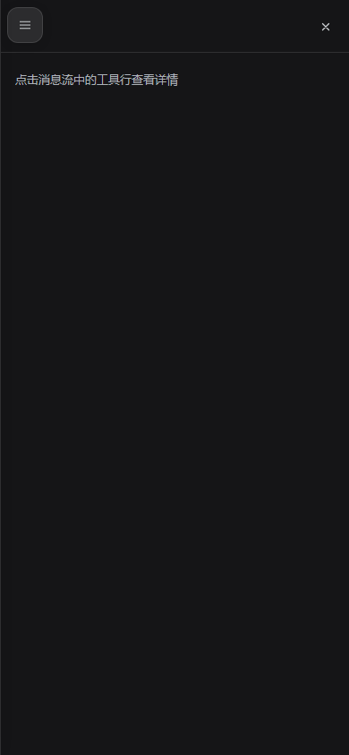
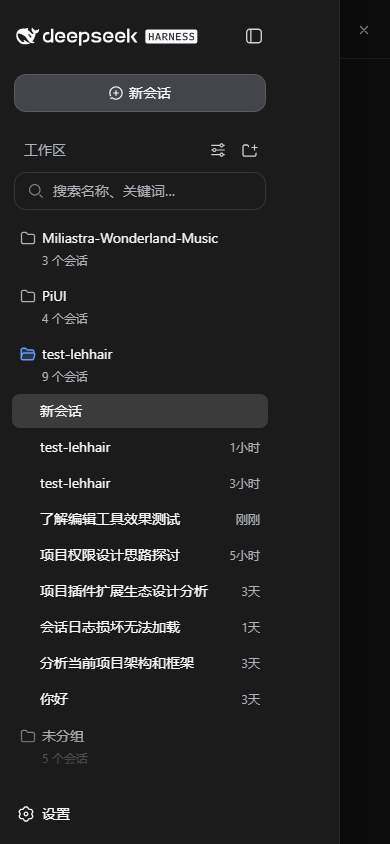

# dsh-mobile

DSH WebUI 移动端适配插件（PiUI 移动端样式 + dsh-split-panes 原生 chrome 风格）：窄屏下信息流独占整屏、侧边栏变为滑入抽屉、安全区/虚拟键盘避让、触控目标放大、粗指针隐藏滚动条。**纯客户端适配，零核心改动**——官方 rc.2 发行版直接可用，不依赖任何扩展点 patch。

## 功能

- **单列信息流**：≤768px 时三栏框架强制收缩为 `0 / 1fr / 0`，对话区占满整屏，分栏拖柄隐藏
- **侧边栏抽屉**：侧边栏变成从左滑入的抽屉（90vw，上限 340px）+ 半透明遮罩；会话页头菜单按钮（`conversation.session.header.actions` 槽位，phone-only）与无会话 hero 的悬浮菜单按钮均可开合；点击遮罩、点击抽屉内会话行、或切换会话后自动收起
- **安全区与键盘**：`viewport-fit=cover` + safe-area env() 变量 + visualViewport 驱动的 `--dshm-keyboard-inset`，输入条悬浮在 Home 指示条与虚拟键盘之上；`100dvh` 动态视口（iOS Safari 地址栏安全）
- **触控优化**：按钮最小 32px 命中高度（PiUI 基线，tab/switch 除外）、粗指针下隐藏全部滚动条、`overscroll-behavior` 防页面回弹、点击高亮透明
- **原生视觉**：桌面宽度下逐字节等同原生（全部规则以 `<html data-dsh-mobile>` 为作用域，卸载即恢复原样）

## 效果

| 桌面（原生三栏） | 手机（抽屉关） | 手机（抽屉开） |
|---|---|---|
|  |  |  |

## 安装

```sh
git clone https://github.com/dsh-external/dsh-mobile.git
dsh plugin --profile web add link:E:/dev/dsh-mobile
```

重启 `dsh web`，用手机模式（DevTools 设备模拟）或真实手机访问即可。

## 使用

- **打开侧边栏**：会话页头左侧 ☰（仅手机宽度显示）；无会话的起始页为左上角悬浮 ☰
- **关闭**：点遮罩、点抽屉里的会话行（选中后自动收起）、点抽屉内的折叠按钮
- **桌面不受影响**：≥769px 时菜单按钮隐藏，框架恢复三栏

## 设计约束（为什么是 CSS + 轻量控制器，而不是替换 root）

- dsh 的 `root` 槽位是框架内建的 `single` 槽，由 ui-layout 独占——插件不能替换 AppFrame
- 因此移动端改造全部作用于 **AppFrame 的稳定 data 属性**（`data-sidebar-collapsed` / `data-details-collapsed`，rc.2 与工作区快照一致）与对话骨架的 data 座位（`[data-phase]` / `[data-conversation-scroll]` / `[data-composer-seat]` 等），**不依赖任何哈希类名**
- **已知限制**：窄屏下详情列（details panel）仍遵循框架让步链自动关闭（核心行为，插件不越权）；本快照中详情列本身也只有空态。想改变它属于 in-repo 改动（dsh-focus-chat README 同款结论）
- 键盘 inset 依赖 `visualViewport`（现代浏览器/PWA 均有）；不支持时退化为 0

## 开发

```sh
pnpm install        # devDeps link 到 ../test-lehhair（DSH 源码，需先构建其 client 包）
pnpm run check      # typecheck + test + build
```

```
src/client/
  controller.ts      # DOM 控制器：viewport meta、抽屉镜像、键盘 inset、遮罩/FAB、会话切换收起
  mobile.css         # 全局移动端样式表（<style data-plugin> 注入，卸载即移除）
  MobileMenuButton.tsx  # 页头 ☰（header.actions 槽位，order -10）
  locales.ts         # 中英文案
```

## License

BSD-3-Clause
